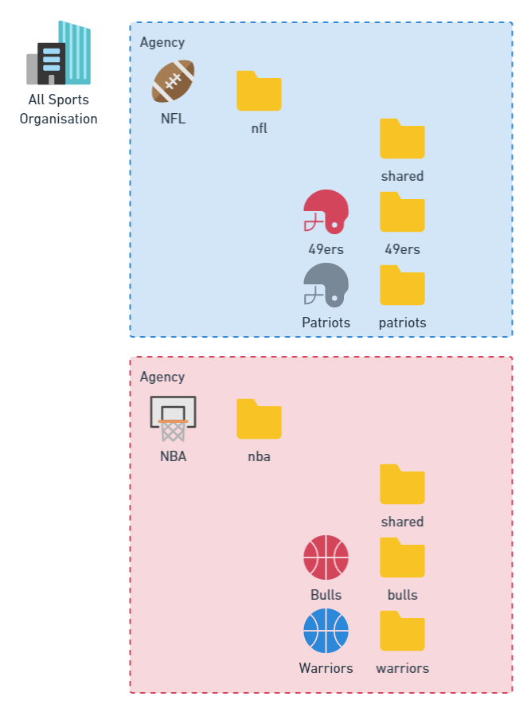
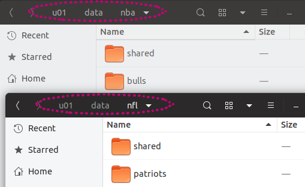
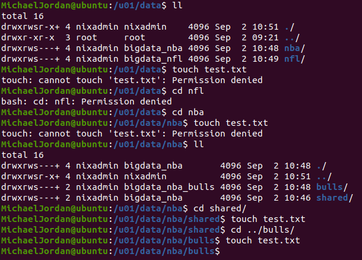

# Deploy a security model (users, groups and shared directory structure) for Linix system for enterprise data

This package was designed to run on Ubuntu 20.04.
This package has some dependencies including ACLs and JQ which will be outlined in the `setup.sh`.

## Description

This code repository will create everything required to implement the security model from start to finish.

The structure of the security model is based on a two level organisation structure. The organisation has agencies which comprise of business units. This is represented by:

- Agency NFL
  - Business unit 49ers
  - Business unit patriots
- Agency NBA
  - Business unit Bulls
  - Business unit Warriors



Each agency has a shared directory that each business unit can read and write to for files that are shared between business units. Then each business unit has a directory that only they can read and write from.

## Getting Setup

Follow the manual steps in 

```sh
cat setup.sh
```

```sh
## Create user for sysadmin
useradd -m nixadmin -p nixadmin
# Create group for admin
groupadd sysadmin
# Add user to group
useradd -m nixadmin -p nixadmin
# Add user to sudo group
usermod -aG sudo nixadmin
# Create data root
mkdir /u01/data

# Install dependancy
sudo apt install jq
sudo apt install acl

# Login as nixadmin
su nixadmin

# Set the permissions on the data directory
sudo setfacl --restore=./acl-files/data.acl
```

The administrator account and group is `nixadmin`. If you choose to change this you will need to update the ACL files that use this user and group as well.

Once you have run the manual steps in `setup.sh` you need to make the following scrips executable.

```sh
sudo chmod +x users-groups.sh
sudo chmod +x dir-agency.sh
sudo chmod +x dir-businessunit.sh
```

Firstly run this script to create the users and groups. Modify this to suit your organisation, and also update the corresponding ACL files. If you have users and groups from an identity provider such as Active Directory then you will skip this step.

```sh
## Create the users and groups
sudo ./users-groups.sh
```

## Usage

Run order of the scripts there after is following:

```sh
## Only run this command once for each agency (example agency NFL)
sudo ./dir-agency.sh -p ./param-files/global.json -l a -a nfl
## Only run this command once for each business unit (example business unit Patriots)
sudo ./dir-businessunit.sh -p ./param-files/global.json -l b -a nfl -b patriots
```

## Success

The directories have been deployed as per the security model:  


The example user MichaelJordan in `{agency: nba, businessunit: bulls}` can change into directories allowed and write files where allowed.  

